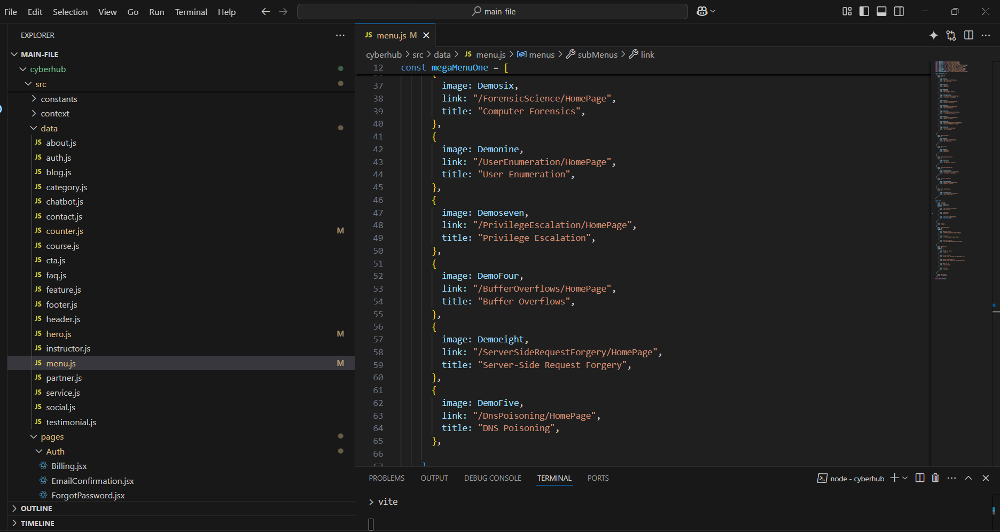

# Cyberhub Project

## Folder & File Structure

```


## Setup Instructions

1. Install Node.js (version 18 or higher recommended) from [https://nodejs.org/](https://nodejs.org/).
2. Install Git from [https://git-scm.com/](https://git-scm.com/).
3. From the root directory of the project, run:
   ```bash
   npm install
   npm run dev
   ```
4. The development server will be accessible at [http://localhost:5173](http://localhost:5173).

## Customization

- Modify React components in `cyberhub/src/components`.
- Update styles in `cyberhub/src/assets/scss`.
- Change content such as images, headings, and text in `cyberhub/src/data`.

## Support

For questions or feedback, contact: 210201890@ostimteknik.edu.tr

## Changelog

- **v1.0.1** - Initial release of Cyberhub platform (March 15, 2025)
